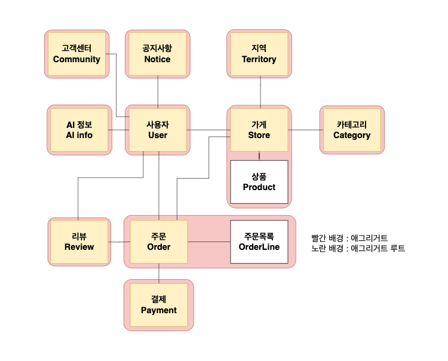
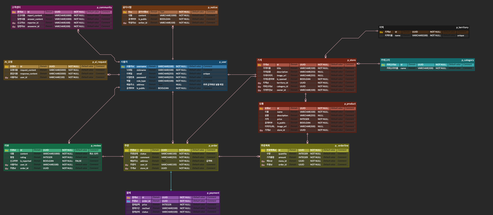

# 🐿️ 2조 - 2제 팀이름을 정해조

> 배달 중계 서비스

---

## 🐒 구성원

| 이름                                         | 역할 분담                        |
|--------------------------------------------|------------------------------|
| [김재윤](https://github.com/lycoris62)        | 주문, 주문상품, 결제, 리뷰, 배포         |
| [김형철](https://github.com/shurona)          | 가게, 상품, 카테고리, 지리, 공지사항, 고객센터 |
| [조성진](https://github.com/korean-jindo-dog) | 유저, 인증/인가, AI                |

## 🐹 개발 환경

| 분류         | 상세                                  |
|------------|:------------------------------------|
| IDE        | IntelliJ                            |
| Language   | Java 17                             |
| Framework  | Spring Boot 3.3.3                   |
| Repository | H2 In-memory(Test), PostgreSQL 16.4 |
| Build Tool | Gradle 8.8                          |
| Infra      | EC2, Docker, Github Actions         |

## 👻 상세 개발 환경

### Dependencies

- Spring WebMVC
- Spring Validation
- Spring Security
- Spring Data Jpa
- Spring Data Redis
- Thymeleaf
- jjwt 0.12.5
- QueryDSL 5.0.0
- mapStruct 1.5.5.Final
- Lombok
- JUnit
- Swagger 2.6.0
- Jacoco

## 🐰 프로젝트 상세

### 도메인 주도 설계 (DDD) 일부 도입

총 10개의 애그리거트로 구성되어 있습니다.

## 🐳 ERD

- [ErdCloud](https://www.erdcloud.com/d/wKTSxmnmGstaHiwgS)

## 🐙 API docs

- [Swagger UI](https://app.swaggerhub.com/apis-docs/choose-name-plz/baedal-proto/0.0.1)

